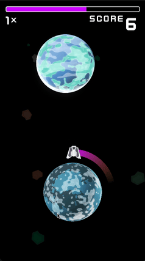

# Shape Jump

Godot game created based off or tutorial by [KidsCanCode](https://www.youtube.com/watch?v=wU6otgwaNQg&list=PLsk-HSGFjnaHH6JyhJI2w8JI76v1F6B-X)

### Tested on

- Godot 3.5

##### Tools used

- [Desmos | Graphing Calculator](https://www.desmos.com/calculator)
  - [circle-jump-game-circle-difficulty | Desmos](https://www.desmos.com/calculator/piy0sc3syr)
